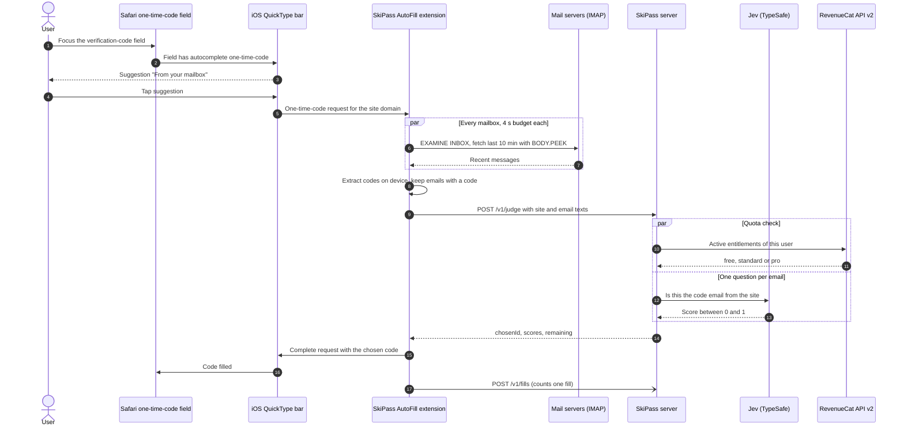
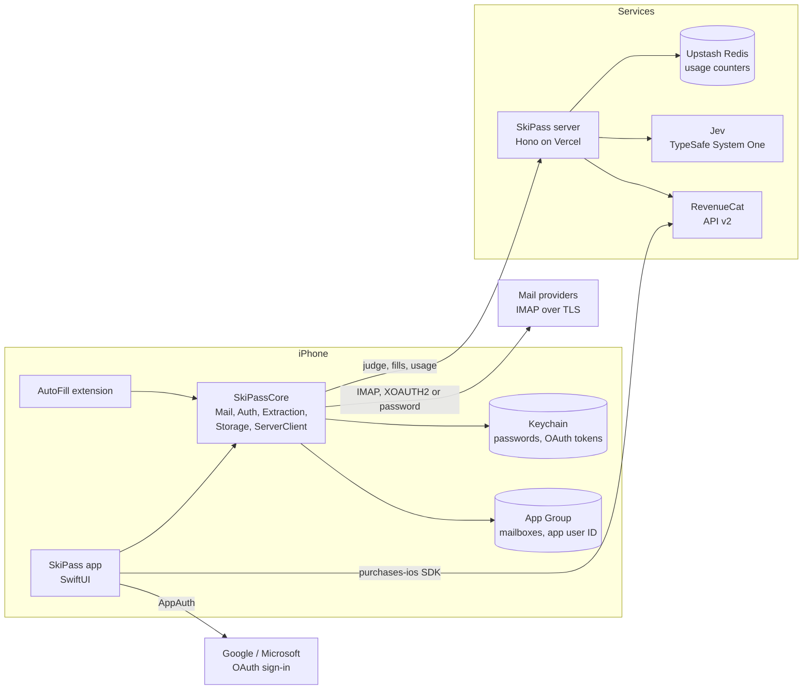

# SkiPass

Email verification codes filled into iOS one-time-code fields from any mailbox, with the right code chosen for the site that asked.

[](https://github.com/rkceve/SkiPass/actions/workflows/ci.yml)

SkiPass is an iOS app plus an AutoFill Credential Provider extension (iOS 18+). When you focus a verification-code field in Safari or an app, SkiPass appears as a suggestion above the keyboard. One tap reads your recent mail, finds the code, checks which email belongs to the site you are signing in to, and fills it.

## Contents

- [The problem](#the-problem)
- [How it works](#how-it-works)
- [Why Jev](#why-jev)
- [Evaluation](#evaluation)
- [Monetization with RevenueCat](#monetization-with-revenuecat)
- [Privacy and security model](#privacy-and-security-model)
- [Architecture](#architecture)
- [Repository map](#repository-map)
- [Getting started](#getting-started)
- [Tests and CI](#tests-and-ci)
- [Limitations and known trade-offs](#limitations-and-known-trade-offs)
- [Tech stack and third-party licenses](#tech-stack-and-third-party-licenses)
- [How it was built](#how-it-was-built)
- [License](#license)

## The problem

- iOS can suggest a verification code that arrived by email only when that email lands in Apple's own Mail app. People who read mail in the Gmail or Outlook app, or in a web client, get no suggestion.
- They switch apps, find the email, copy the code, switch back and paste it. It takes several steps and sometimes the code expires on the way.
- When several codes arrive at once (two sign-ins, a resend, a promotion that contains a number), it is easy to paste the wrong one.

SkiPass reads the mailboxes directly (Gmail, Outlook and any IMAP account), so it works no matter which mail app you use, and it picks the email that belongs to the requesting site instead of simply the newest one.

## How it works

1. You add your mailboxes in the SkiPass app. Gmail and Outlook.com addresses open the provider's official sign-in page (OAuth); any other address uses IMAP host, port and password.
2. The app registers one-time-code identities with iOS for a bundled list of popular sign-in domains, the demo site, and domains seen in earlier code emails, so the suggestion appears even on your first visit.
3. You focus a one-time-code field. iOS shows the SkiPass suggestion above the keyboard (subtitle `From <your mailbox>`).
4. You tap it. The extension reads INBOX messages from the last 10 minutes from every mailbox in parallel (4 s budget per mailbox), without marking anything as read.
5. The code is extracted on the device (a Swift port of the open-source 2FHey parser; subject first, then body). Emails without a code are dropped.
6. The remaining emails go to the SkiPass server, which asks Jev one yes/no question per email: "is this the code email from this site?" The highest score of at least 0.5 wins.
7. The extension fills that email's code, then reports one fill to the server.

If the server cannot be reached, the extension still fills a code using a local rule (see [trade-offs](#limitations-and-known-trade-offs)). If no email matches or the monthly allowance is used up, nothing is filled and no UI is shown.



## Why Jev

Picking "the newest email with a code" fails exactly when it matters: two sites sent codes, a code was resent, or a newsletter arrived with a discount number. Matching the sender domain is not enough either: many services send codes from a mail provider or a brand name that differs from the site's domain.

SkiPass asks [Jev](https://docs.typesafe.ai/) (TypeSafe's System One API) a separate yes/no question for each email, phrased against the site that asked for the code:

> A user is signing in on the website `<site>` and needs the one-time code that this website just emailed them. Is this email that code email from `<site>` (the sender may use a different brand name or email provider, but the email mentions or links to `<site>`)?

Each answer is a Noul score between 0 and 1. The server picks the highest score of at least 0.5 (ties go to the newest `Date:`), or nothing when no email reaches 0.5. All questions run in parallel with a 3 s timeout, alongside the plan lookup. Any Jev failure switches the whole request to a deterministic fallback rule (newest email that mentions the site's registrable domain, else the newest email) and the response says `"source": "fallback"`.

The question wording was chosen by a live comparison: the source records that the correct code email scored 0.87 with this wording against 0.65 with the first version, while other sites' code emails and promotions stayed at 0.01 to 0.02 (comment in [`server/src/jev.ts`](server/src/jev.ts)).

## Evaluation

64 synthetic inbox scenarios (2–5 recent code-bearing emails each, 9 categories, 8 with no correct
email) compare three ways of choosing which email's code to fill, using the production selection code
and the live Jev API. Full method, per-category results and limitations: [`eval/RESULTS.md`](eval/RESULTS.md).

| Strategy | Accuracy | Wrong code filled |
|---|---|---|
| Newest code email (what a naive autofill does) | 10/64 (15.6%) | 54 |
| Site-domain rule (the on-device / server fallback) | 37/64 (57.8%) | 27 |
| **Jev, one yes/no question per email** | **64/64 (100%)** | **0** |

Jev latency measured from the client: p50 133 ms / p95 188 ms per request, all emails judged in
parallel. Cost: about $0.00005 per autofill at $0.042 per million input tokens.

Honest caveats: the scenarios are author-written and deliberately hard for simple rules, so these are
not real-world rates. The first run scored 62/64; both misses were a resent code scored 0.96 vs the
original's 0.97, which led to the current rule "scores within 0.05 of the best count as a tie and the
newest email wins" (`SCORE_TIE_MARGIN` in `server/src/jev.ts`). That rule was tuned on this same set.

## Monetization with RevenueCat

SkiPass charges for successful autofills, the moment where it saves you time. **One fill = one code SkiPass actually filled.** Judging, failed lookups and "no match" results are never counted.

| Plan | Price (RevenueCat offering) | Fills per month | Entitlement |
|---|---|---|---|
| Free | $0 | 10 | none |
| Standard | $4.99 / month | 100 | `standard` |
| Pro | $24.99 / month | 1,000 | `pro` |

The limits live in one table, [`server/src/plans.ts`](server/src/plans.ts). They are still marked as provisional there.

How it fits together:

- **The app** uses the RevenueCat SDK (`purchases-ios`) with an anonymous app user ID. It shows the current offering's packages and buys a package when you tap a plan. The app user ID is shared with the extension through the App Group, so both talk to the server as the same RevenueCat customer.
- **The server is the source of truth.** It reads the customer's active entitlements from the RevenueCat REST API v2 and maps them to a plan, the highest active tier winning (`pro` over `standard`). Usage is an atomic per-user, per-UTC-month counter in Upstash Redis. The client cannot raise its own limit.
- **Checks happen at the right time.** `/v1/judge` refuses with 402 when the month's allowance is used up, before anything is filled. `/v1/fills` counts only after iOS accepted the code.
- **Low-pressure plan screen.** A Plan tab shows the current plan, "N of M left" and the reset date, with the other plans listed underneath. There are no banners, pop-ups or interruptions in the autofill flow; when the allowance runs out, the suggestion simply does nothing until the next month or an upgrade.
- **Upgrades apply immediately.** Choosing a lower paid plan does not remove a higher active one; the higher tier stays current until it ends. Choosing Free opens RevenueCat's manage-subscriptions path.
- **Hackathon build uses the RevenueCat Test Store.** Purchases go through Test Store's own purchase sheet, so no App Store account or real payment is involved. Test Store subscriptions cannot be cancelled from the app; they end by themselves.
- **Resilience.** If RevenueCat is unreachable, the server uses the user's last known plan (kept for 30 days) instead of downgrading a paying user.

## Privacy and security model

| What | Where it goes | When |
|---|---|---|
| Mailbox passwords and OAuth tokens | iOS Keychain on the device only (`AfterFirstUnlockThisDeviceOnly`, not synced to iCloud) | When you add an account |
| Mailbox list (address, host, port, username), domains of code emails already filled | App Group storage on the device | When you add an account; after a fill |
| Email contents | Read on the device. Only emails received in the **last 10 minutes** that **contain a code** are sent to the SkiPass server and to Jev, to be judged | Only when you tap the SkiPass suggestion |
| The requesting site's domain | SkiPass server and Jev, as part of the question | Same moment |
| RevenueCat app user ID (anonymous) | SkiPass server and RevenueCat | Every server request |
| Fill count per user per month, last known plan, hourly rate-limit counters | Upstash Redis | On fills and judge requests |

Guarantees in the code:

- **No email text or metadata is stored or logged by the server.** Its only log lines are configuration errors, which name variables, never values or content. Jev and RevenueCat errors are deliberately not logged, because error objects could carry request data.
- **Messages are never marked as read.** INBOX is opened with IMAP `EXAMINE` (read-only) and every fetch uses `BODY.PEEK`.
- **Encrypted connections only.** IMAP uses implicit TLS on port 993 and STARTTLS on any other port, never plaintext.
- **Mail is read only on demand**, when you tap the suggestion. There is no background mail polling.
- **Abuse limits on the server.** Every request needs the app token and an `X-SkiPass-User` that RevenueCat knows; unknown IDs get 401 `unknown_user` before Jev is called or anything is counted. `/v1/judge` is limited to 60 requests per user and 300 per client IP per UTC hour (429). The app token ships inside the app, so it is treated as public; these checks are what actually limit abuse.
- **Secrets are not in the repository.** Build-time keys come from a git-ignored `Secrets.xcconfig` or GitHub Actions secrets; server keys are Vercel environment variables.

## Architecture

| Component | Path | Runs on | Role |
|---|---|---|---|
| App | [`ios/App`](ios/App), [`ios/SkiPassUI`](ios/SkiPassUI) | iPhone, iOS 18+ | Account setup (IMAP, Google and Microsoft sign-in), plan screen, identity registration |
| AutoFill extension | [`ios/Extension`](ios/Extension) | Same iPhone | Answers one-time-code requests: fetch, extract, judge, fill |
| Shared core | [`ios/SkiPassCore`](ios/SkiPassCore) | App and extension | Models, storage (App Group and Keychain), IMAP, OAuth, extraction, server client |
| Server | [`server`](server) | Vercel (Hono) with Upstash Redis; a Cloudflare Workers entry is kept buildable | Judging via Jev, plan lookup via RevenueCat, usage metering |
| Demo site | [`demo-web`](demo-web) | Vercel, email via Resend | "Sowbank", a fictional sign-up page that emails a 6-digit code to test the full flow |
| CI and packaging | [`.github/workflows`](.github/workflows) | GitHub Actions (macOS 15, Ubuntu) | Tests, device IPA builds, UI tour recording |



More detail: [docs/ARCHITECTURE.md](docs/ARCHITECTURE.md) (components and flows), [docs/API.md](docs/API.md) (server HTTP API), [docs/DECISIONS.md](docs/DECISIONS.md) (why things are built this way).

## Repository map

| Path | Contents |
|---|---|
| `ios/App/` | App entry point, `AppModel` (state, purchases, usage), concrete service wiring, app unit tests |
| `ios/SkiPassUI/` | SwiftUI screens (Home, Plan, add/edit account) as a local Swift package, with tests |
| `ios/Extension/` | Credential provider view controller, resolver (fetch, extract, judge, fallback), identity registration, tests |
| `ios/SkiPassCore/` | Swift package: `SkiPassModels`, `SkiPassStorage`, `SkiPassMail`, `SkiPassAuth`, `SkiPassAuthUI`, `SkiPassExtraction`, `SkiPassServerClient`, with tests |
| `ios/Config/` | Info.plist, entitlements, `Secrets.example.xcconfig` |
| `ios/Probe/`, `ios/UITests/` | CI-only probe app that checks one-time-code AutoFill from a third-party provider in the Simulator; UI tour test |
| `server/` | Hono server: `src/api.ts` (routes), `src/jev.ts`, `src/revenuecat.ts`, `src/plans.ts`, `src/usage.ts`, tests |
| `demo-web/` | Demo sign-up site used in the video (Vercel functions + static pages) |
| `probe-site/` | Static one-time-code page used by the CI probe (GitHub Pages) |
| `design/` | Screen mockups |
| `project.yml` | XcodeGen spec for the Xcode project (the `.xcodeproj` is generated, not committed) |
| `.github/workflows/` | `ci`, `ipa`, `tour`, `probe`, `pages`, `live-sim` |

## Getting started

### Without a Mac (GitHub Actions + sideloading)

No local Mac is needed: the Swift code is compiled and tested on GitHub's macOS runners, and the device build is packaged there too.

1. Fork the repository.
2. Optional: add repository secrets (Settings > Secrets and variables > Actions): `SKIPASS_SERVER_URL`, `SKIPASS_APP_TOKEN`, `GOOGLE_CLIENT_ID`, `MICROSOFT_CLIENT_ID`, `REVENUECAT_API_KEY`. Each one that is missing leaves the example placeholder in the build, and the app treats it as not configured:
   - no server: the extension picks codes with the on-device fallback rule and nothing is counted;
   - no Google or Microsoft client ID: those sign-ins show "not configured in this build" (IMAP accounts still work);
   - no RevenueCat key: the Plan tab shows "Plans are unavailable in this build."
3. Actions > **ipa** > Run workflow. It builds a Debug device build (see [DECISIONS](docs/DECISIONS.md#7-debug-ipa-because-of-the-revenuecat-test-store)) and uploads `SkiPass-v<version>-b<run>.ipa` as an artifact, kept for 3 days.
4. Install the IPA with a sideloading tool that re-signs it with a free Apple ID (the workflow was built for Sideloadly on Windows). Follow the tool's steps for trusting the developer profile and enabling Developer Mode on the iPhone. Apps signed with a free Apple ID must be re-installed every 7 days.
5. On the iPhone, turn SkiPass on under Settings > General > AutoFill & Passwords.
6. Open SkiPass, add a mailbox, then open a site with a verification-code field, for example the demo at https://skipass-demo.vercel.app.

### With a Mac (XcodeGen)

```sh
brew install xcodegen
cp ios/Config/Secrets.example.xcconfig ios/Config/Secrets.xcconfig   # git-ignored; fill in real values or keep placeholders
xcodegen generate
open SkiPass.xcodeproj
```

Choose your own development team for the `SkiPass` and `SkiPassAutoFill` targets, then run the `SkiPass` scheme on an iPhone with iOS 18 or later. Keep the Debug configuration when using a RevenueCat Test Store key.

### Server and demo site locally (mock modes)

The server runs without any real keys: `JEV_MODE=mock` replaces Jev with a deterministic stand-in (an email that mentions the site's domain or brand word scores 0.9, others 0.1) and `REVENUECAT_MODE=mock` treats every user as a known Free user.

```sh
cd server
npm install
cp .dev.vars.example .dev.vars   # APP_TOKEN=dev-app-token, JEV_MODE=mock, REVENUECAT_MODE=mock
npm run dev                      # wrangler dev at http://localhost:8787
```

```sh
curl -s http://localhost:8787/v1/judge \
  -H 'Content-Type: application/json' \
  -H 'X-SkiPass-App-Token: dev-app-token' \
  -H 'X-SkiPass-User: local-test' \
  -d '{"service":"skipass-demo.vercel.app","messages":[
        {"id":"a:1","text":"From: shop@example.com\nSubject: 20% off\nDate: 2026-09-27T10:00:00Z\n\nUse 482913 today"},
        {"id":"a:2","text":"From: noreply@sowbank.example\nSubject: 604182 is your Sowbank verification code\nDate: 2026-09-27T09:59:00Z\n\nhttps://skipass-demo.vercel.app"}]}'
# {"chosenId":"a:2","scores":{"a:1":0.1,"a:2":0.9},"remaining":10,"source":"mock"}
```

The demo site (`demo-web/`) needs Resend and Upstash credentials to send mail; its tests run without them:

```sh
cd demo-web && npm install && npm test && npm run typecheck
```

Deployment steps for Vercel and Cloudflare are in [server/README.md](server/README.md) and [demo-web/README.md](demo-web/README.md).

## Tests and CI

[`ci.yml`](.github/workflows/ci.yml) runs on every push and pull request:

| Job | What it runs |
|---|---|
| `core` | `SkiPassCore` package tests in the iOS Simulator (storage, IMAP fetch logic, OAuth, extraction including 2FHey cases and HTML fixtures, server client) |
| `ui-package` | `SkiPassUI` package build and tests |
| `app` | XcodeGen project, app build, `SkiPassAppTests` (plan selection, entitlements, usage) |
| `extension` | `SkiPassExtensionTests` (resolver, fallback rule, identity registration, request gate) |
| `server` | `npm test` (Vitest in the Workers runtime, both Vercel and Cloudflare entries), `npm run typecheck`, Worker bundle dry run |
| `demo-web` | `npm test` and `npm run typecheck` |

Other workflows: `ipa` (device IPA for sideloading), `tour` (screen recording of every screen with in-memory fixtures), `probe` (checks one-time-code AutoFill from a third-party provider in the Simulator), `pages` (publishes the probe page), `live-sim` (a browser-streamed Simulator for manual checks from a non-Mac machine).

## Limitations and known trade-offs

- **iOS controls the suggestion.** iOS decides the suggestion's wording and layout; an extension can only set its subtitle (`From <mailbox address>`). The code is not shown before tapping, because mail is read only after the tap.
- **Several mailboxes share one label.** With more than one mailbox, the suggestion is labelled with the first address only.
- **First visit needs a registered domain.** iOS only offers SkiPass on sites it has an identity for. SkiPass registers a bundled list of about 100 popular sign-in domains, the demo site, and domains from code emails it has already filled. A site outside that set shows no suggestion until SkiPass has seen one of its emails.
- **No in-app guide for turning on AutoFill.** You enable SkiPass in iOS Settings yourself.
- **Quota enforcement is best-effort.** When the server is unreachable (timeout, 5xx, 401, 429, bad reply) the extension still fills using the local fallback rule without a quota check, and reports the fill later if it can. A fill is counted after it happens, so two fills at the same moment can pass the same check. This favours a working demo over strict metering.
- **The app token is public.** It ships inside the app. Abuse is limited by rejecting user IDs RevenueCat does not know and by rate limits.
- **RevenueCat outage.** The server uses the last known plan; with none known, the quota is not enforced for that request and `/v1/usage` reports `plan: "unknown"`.
- **Keychain sharing after re-signing is device-only.** Whether the app and extension still share Keychain items after a sideloading tool re-signs them can only be checked on a device; both log the App Group and Keychain group they resolved.
- **Test Store only.** The hackathon build uses the RevenueCat Test Store, which requires a Debug build and has no in-app cancellation; there is no App Store release.
- **Fixed look-back.** Only emails from the last 10 minutes are considered, and each mailbox gets 4 seconds.

## Tech stack and third-party licenses

| Area | Technology | License |
|---|---|---|
| App and extension | Swift 6, SwiftUI, AuthenticationServices (iOS 18+), XcodeGen | - |
| IMAP | [SwiftMail](https://github.com/Cocoanetics/SwiftMail) 1.12.0 (on SwiftNIO) | BSD-2-Clause |
| OAuth sign-in | [AppAuth-iOS](https://github.com/openid/AppAuth-iOS) 3.0.0 | Apache-2.0 |
| Code extraction | Port of [2FHey](https://github.com/SoFriendly/2fhey) parser and pattern files | CC0-1.0 |
| Subscriptions | [RevenueCat purchases-ios](https://github.com/RevenueCat/purchases-ios) 5.91.0 | MIT |
| Server | [Hono](https://github.com/honojs/hono) 4, TypeScript, Vercel, Upstash Redis | MIT |
| Domain parsing | [tldts](https://github.com/remusao/tldts) 7 | MIT |
| Matching | Jev (TypeSafe System One HTTP API) | commercial API |
| Demo mail | Resend HTTP API | commercial API |

Full notices for bundled code: [THIRD_PARTY_NOTICES.md](THIRD_PARTY_NOTICES.md).

## How it was built

SkiPass was developed with AI assistance (Claude Code) for code, tests and documentation. Changes are checked by the CI jobs above; Behaviour the Simulator cannot show, such as sideloaded signing and Test Store purchases, was checked on an iPhone.

## License

[MIT](LICENSE)
